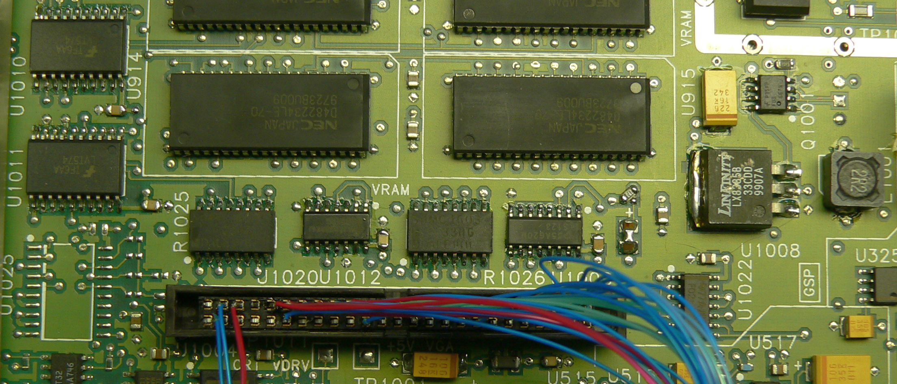

# Digital driver upgrade for the LCD

[EEVBlog Post](https://www.eevblog.com/forum/testgear/upgrading-the-hpagilent-8714c-from-green-crt-to-color-lcd/msg1118595/#msg1118595)

I already had miscellaneous parts like caps and resistors on hand. 

U1025 is used for brightness control, but I didn't install it since I assume the firmware lacks support for that feature.

I simply grounded the unused LSBs of the LCD.

Here's a list of the part numbers. Standard parts from Mouser.

U1008 -- LX8385B-33CDD -- 3.3v regulator
Q1001 -- FDS6679 -- P channel MOSFET
R1025 -- SOMC160333R0GEA  -- resistor array, 33 ohms
R1026 -- SOMC160333R0GEA  -- resistor array, 33 ohms
U1012 -- SN74LVT125D
U1009 -- SN74LS123DR
U1010 -- 74LVT574WMX
U1011 -- 74LVT574WMX
J1020 -- A3E-50PA-2DSA(71)
