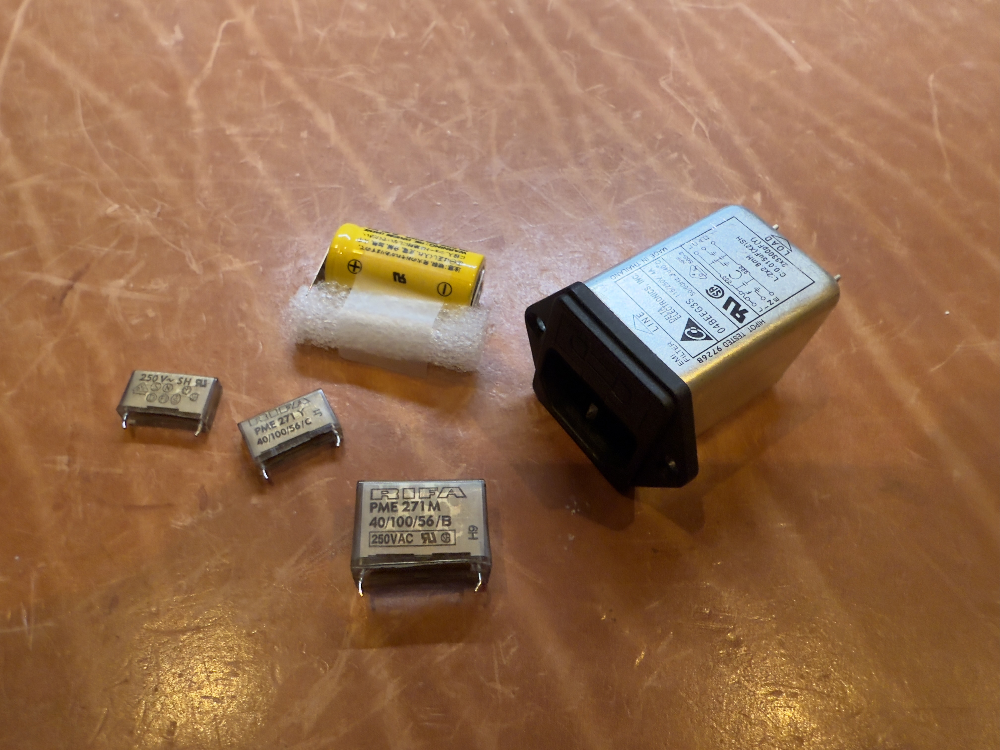
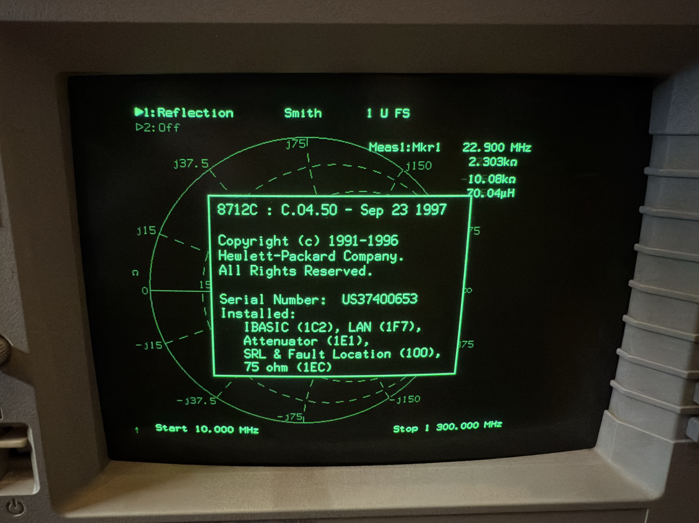

# HP 8711C RF Network Analyzer

HP 8711C RF Network Analyzer Reverse Engineering and Hacks

I have done some work with Ghidra to look into the firmware ROM. I've also added the documentation I could found and schematics.

## First steps

Before doing *ANYTHING*, please do a backup of the Correction constants! Not just the non-volatile RAM, but also on a floppy disk! Make sure to copy it of the floppy to e.g. a USB stick, which you keep with the device. Just in case!

## Software update to C.04.52

The latest firmware for the 8711C, 8712C, 8713C, 8714C is C.04.52. It is available on the [Keysight website](https://www.keysight.com/us/en/lib/software-detail/computer-software/8711c-8712c-8713c-8714c-network-analyzer-firmware-upgrade-c0452-14acirc-mb-1000000337epsgsud.html). I also added it to the repository.

Because the official tools doesn't work in Dosbox and requires an old computer, I've written a little Python script to generate a disk image from the update files. I then used Greaseweazle to write it to a 3.5 HD floppy disk on my Mac. Put the disk into the drive and turn the 871XC on to update the device.

## Maintenance in the power supply

The power supply has 3 RIFA caps (1x 220nF/275V X2, RIFA PME 271M 40/100/56/B and 2x 10nF Y2, RIFA PME 271 Y 40/100/56/C) and a line filter (Delta Electronics 04BEEG3S). All are susceptible to cracking and blowing up.

Once the monitor/power supply unit has been removed, the power supply has 4 screws (one on each side of the cage) and it can be pulled out to the back – do not forget to disconnect the cable from the monitor board to the power supply. In my case it required massive force, because one rubber foot glued itself to the base. It helped to bend-in some of the clamps around the backplate. Typically the power supply needs significant cleaning, because it is full of dust. I've added some photos to show the RIFA caps and the line filter (which can be replaced without removing the power supply).

## Maintenance of the floppy drive

The 3.5 floppy drive might have issues working reliable. I took it out, opened the cover and cleaned the grease from the stepper motor spindle with 99% alcohol. I then applied some Molykote EM-30L synthetic grease to the spindle and turned it carefully back and forth a little bit. If there is any dust, you probably want to clean it up as well. The read/write heads (the bottom and top one) were clean for my device, but you could clean them as well with a cotton bud and 99% alcohol, just do not apply any pressure to them!

## SRAM Battery replacement

The mainboard has a backup battery (Panasonic Lithium Battery BR-2/3A 3V), which should be replaced every 1-8 years (depending on the ambient temperature). The files in RAM should be saved on a floppy disk on in non-volatile RAM before the replacement, to avoid losing any data. Chances are that there is nothing in the RAM anyway, because the battery was long depleted. The memory is managed by a Maxim DS1210 Nonvolatile controller chip. You could check the status, I have simply replaced the battery.

## Adding keyword option without opening the device

There are hacks in the internet, which requires to remove the boot rom, patch it and reflash it. This is not necessary with the 4.5 firmware, because it supports entering the option keyword.

Select 'System Options' => 'System Config' => 'Options Setup'

Now select 'Install Option':

Then you see this:

After a reboot the system shows the options as well:

I've written an ANSI-C application and a python script to generate a code for a given serial number of the device:

- [HP option code generator.py](HP%20option%20code%20generator.py)
- [HP option code generator.c](HP%20option%20code%20generator.c)

## Converting the unit to an 8712C or 8714C without opening the device

There is no opcode code to enable the vector unit with Smith Charts. While the 8711C and 8712C (or 8713C and 8714C) are identical from the hardware side, the license is missing from the BootROM.

So far the typical way to upgrade the unit was to open the device, reading it out, patch it and then reflashing the BootROM. I have found a much easier way, which at least works for macOS and Linux. I have added a way it _could_ work on Windows, but I haven't tested it.

*Warning!* This requires "BootROM revision C.1.00.  October 23, 1996.". I think that is the only revision that exists, if you have a newer one: please dump it and send it to me!

1. Install at least the LAN option from above. Set the IP address of the device. If you do not do that first, you have to directly connect to the device via Ethernet and talk to its default IP adress of 15.4.45.232.
2. Turn the device on and directly after the "All BootROM Selftests Passed." message, hold down the SOFTKEY 7. You should see a "Booting to LAN Monitor". Note the IP address in my case it is "-64.168.1.3" (-64 is a bug in the BootROM treating the first byte as a signed byte, the real value is 256-64 = 192)
3. Launch the Terminal and `cd` into the directory with the `memory` file in it.
4. Launch TFTP with the IP address of the device, like `tftp 192.168.1.3` (use your IP adress from above)
5. Enter `put \memory` and press return. You should see a message on the device, that the memory file was received and a _LINEFEED_! Once that happened, turn the device off and on again.
6. Done!

While I haven't tried it on Windows, this command might do the trick. Again: you need to replace the IP address with the one from your device.

	tftp  -i 192.168.1.3 put \memory

What is in this tiny 80 bytes memory file? It presents itself as a firmware update to the device, but it will not reside in the flash, instead it copies itself into RAM. After the upload, this code is executed. It will read the OC variable (which contains the option constant) and clears all bits for all possible options (except the TV Tuner, which does not work on a vector unit anyway) and calls into the BootROM debugger to write the constant back, just like when you would have entered a license via the UI. Here is the code:

					dc.w 'WL'                   ; Header for the firmware block
					dc.l $C0200000              ; Start address (high up in the DRAM)
					dc.l $C020003F              ; Last address of the data
	
	sub_C0200000:   trap    #$B                 ; Enter Supervisor Mode in pSOS/68K
					move.l  ($C000C6D8).l,d0    ; Read the option constant
					bclr    #$12,d0             ; enable vector option (8712C/8714C)
					bclr    #$14,d0             ; enable LAN
					bclr    #$15,d0             ; enable IBASIC
					bclr    #$16,d0             ; enable Fault/SRL
					jsr     ($226C).l           ; write license back into the BootROM
					pea     aUpdateOkNowReb(pc)
					jsr     $1692A              ; printf("Update OK now reboot\n") - which for some reason doesn't print anything, but I didn't bother to look deeper into this
	loc_C0200028:   bra.s   loc_C0200028        ; endless loop
	
	aUpdateOkNowReb:dc.b 'Update OK now reboot',$A,0
	
					dc.w 'GU'                   ; Header to execute code
					dc.l sub_C0200000           ; jump into our code

You could batch the memory file to enable the 8730A ($13) instead of the vector option ($12). But be careful, they can _NEVER__ be used at the same time!

## LAN Interface

The LAN interface exposes several ports as follows:

- 21/tcp   ftp
- 23/tcp   telnet
- 80/tcp   http
- 5025/tcp SCPI server
- 5030/tcp ?
- 5050/tcp LAN Debugger

FTP and http are fully documented. telnet allows talking via SCPI commands.

Interesting is 5050, which is the LAN Debugger. It is accessible via telnet and even provides help. It allows inspecting the memory and even modifying it:

	✓ ~ > telnet 192.168.1.3 5050
	Trying 192.168.1.3...
	Connected to 192.168.1.3.
	Escape character is '^]'.
	Welcome to the LAN Debugger.  Enter '?' for help.
	> ?
	Available commands are:
	arp
	bootp
	bye
	dbyte	[<hex start address> [num bytes]] - display memory using bytes
	dlong	[<hex start address> [num bytes]] - display memory using longs
	dmem	[<hex start address> [num bytes]] - display memory using bytes
	dword	[<hex start address> [num bytes]] - display memory using words
	ifconfig
	ip
	mem
	ps
	quit
	route
	sbyte	<hex start address> <hexchars> - set memory using bytes
	slong	<hex start address> <hexchars> - set memory using longs
	smem	<hex start address> <hexchars> - set memory using bytes
	socket
	sword	<hex start address> <hexchars> - set memory using words
	tcp
	trace
	udp

There is also an extremely limited TFTP debugger during boot available. It can be accessed by pressing SOFTKEY 7 at the end of the selftest during the boot process. The firmware has an interesting bug, that bytes in an IP address above 127, like 192.168.1.100, will display as -64.168.1.3. However it will work anyway. If the IP address was never set, it will default to 15.4.45.232.