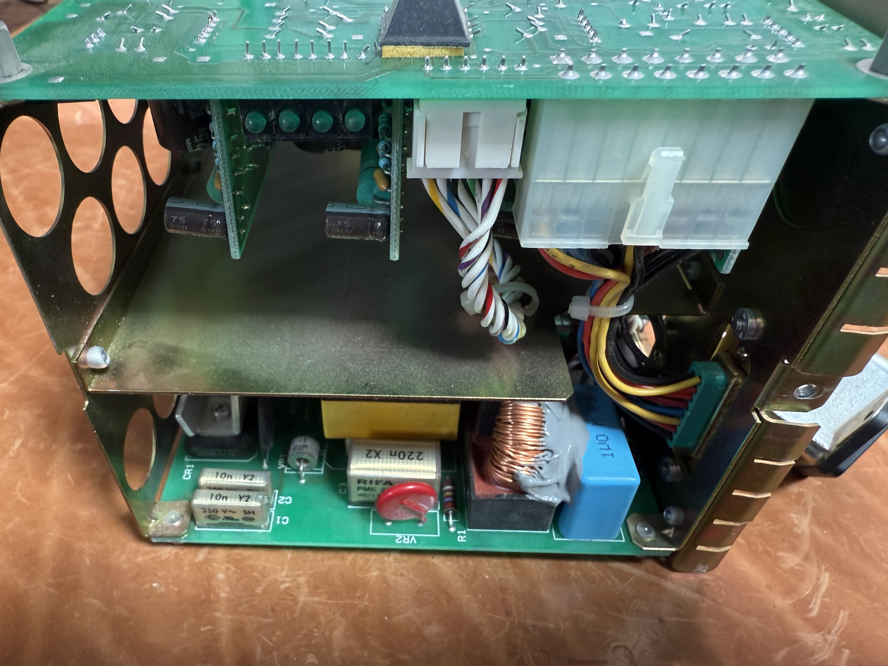
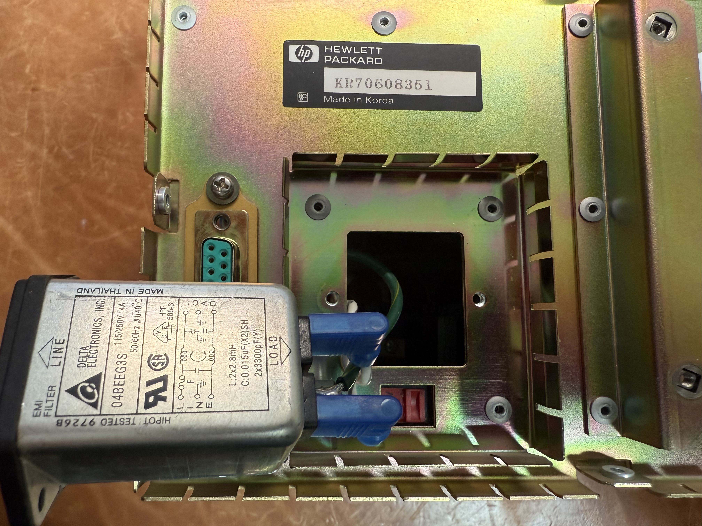
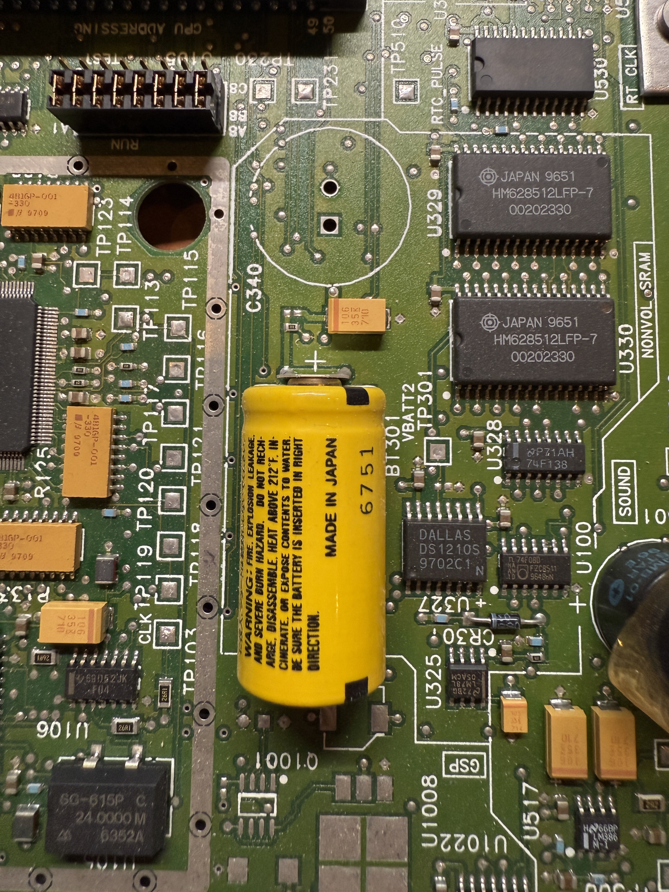
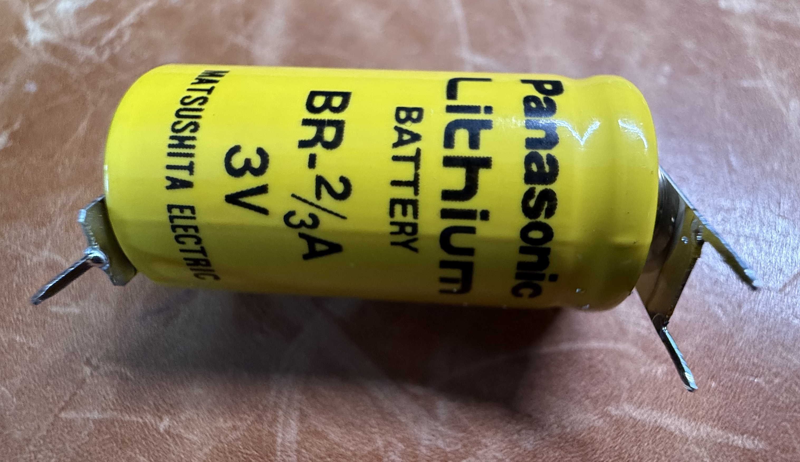
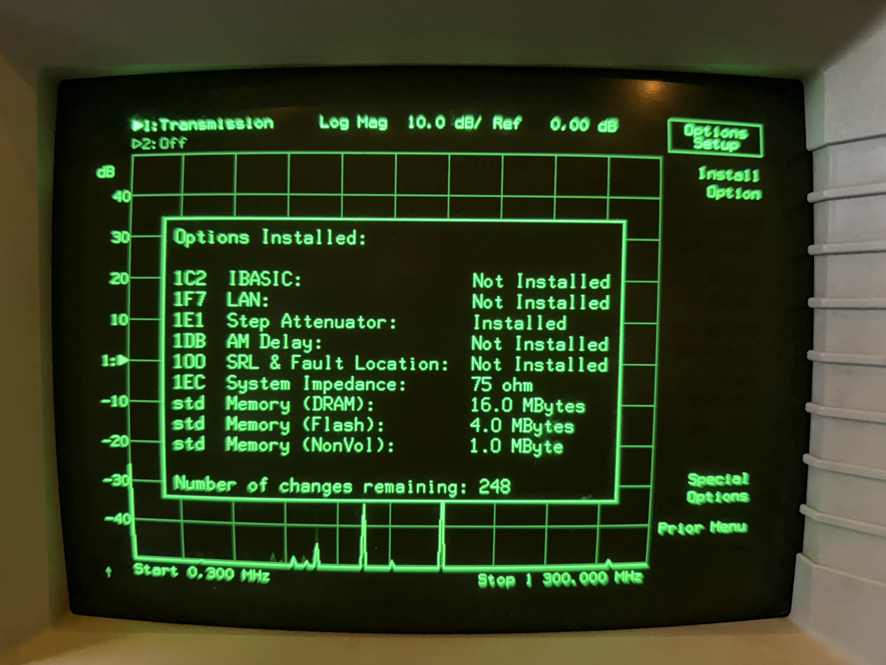
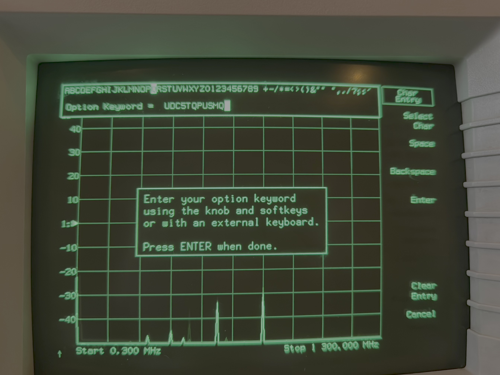

# HP 8711C RF Network Analyzer

HP 8711C RF Network Analyzer Reverse Engineering and Hacks

I have done some work with Ghidra to look into the firmware ROM. I've also added the documentation I could found and schematics.

## Software update

The latest firmware for the 8711C, 8712C, 8713C, 8714C is C.04.52. It is available on the Keysight website, but it requires 8 floppy disks.

https://www.keysight.com/us/en/lib/software-detail/computer-software/8711c-8712c-8713c-8714c-network-analyzer-firmware-upgrade-c0452-14acirc-mb-1000000337epsgsud.html

I also added it to the repository.

## Maintenance in the power supply

The power supply has 3 RIFA caps (1x 220nF/275V X2, RIFA PME 271M 40/100/56/B and 2x 10nF Y2, RIFA PME 271 Y 40/100/56/C) and a line filter (Delta Electronics 04BEEG3S). All are susceptible to cracking and blowing up.

Once the monitor/power supply unit has been removed, the power supply has 4 screws (one on each side of the cage) and it can be pulled out to the back – do not forget to disconnect the cable from the monitor board to the power supply. In my case it required massive force, because one rubber foot glued itself to the base. It helped to bend-in some of the clamps around the backplate. Typically the power supply needs significant cleaning, because it is full of dust. I've added some photos to show the RIFA caps and the line filter (which can be replaced without removing the power supply).

## SRAM Battery replacement

The mainboard has a backup battery (Panasonic Lithium Battery BR-2/3A 3V), which should be replaced every 1-8 years (depending on the ambient temperature). The files in RAM should be saved on a floppy disk on in non-volatile RAM before the replacement, to avoid losing any data. Chances are that there is nothing in the RAM anyway, because the battery was long depleted. The memory is managed by a Maxim DS1210 Nonvolatile controller chip. You could check the status, I have simply replaced the battery.

## Adding keyword option without opening the device

There are hacks in the internet, which requires to remove the boot rom, patch it and reflash it. This is not necessary with the 4.5 firmware, because it supports entering the option keyword.

Select 'System Options' => 'System Config' => 'Options Setup'

Now select 'Install Option':

Then you see this:

After a reboot the system shows the options as well:

I've written an ANSI-C application and a python script to generate a code for a given serial number of the device:

- `HP option code generator.py`
- `HP option code generator.c`
