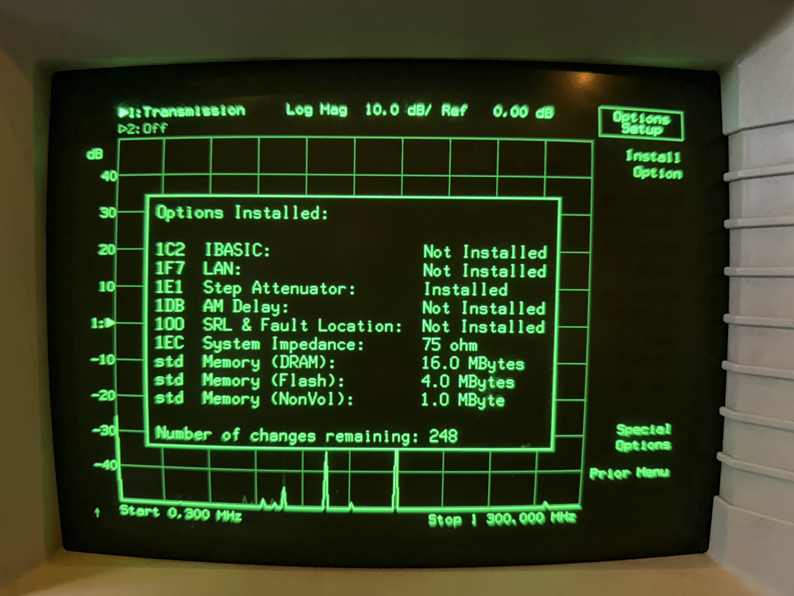
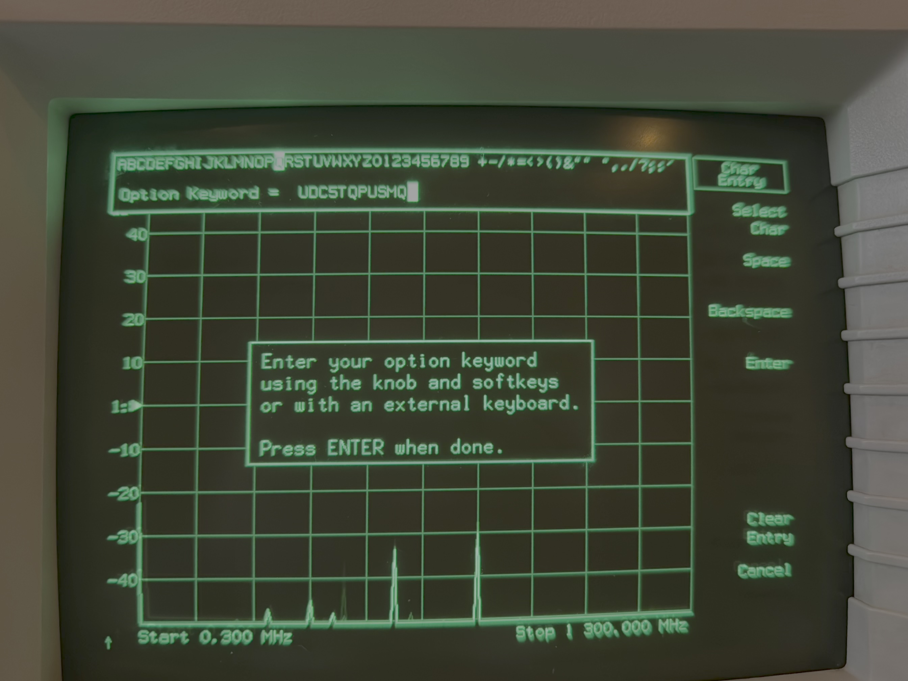

# HP 8711C RF Network Analyzer

HP 8711C RF Network Analyzer Reverse Engineering and Hacks

I have done some work with Ghidra to look into the firmware ROM. I've also added the documentation I could found and schematics.

## Adding keyword option without opening the device

There are hacks in the internet, which requires to remove the boot rom, patch it and reflash it. This is not necessary with the 4.5 firmware, because it supports entering the option keyword.

Select 'System Options' => 'System Config' => 'Options Setup'

Now select 'Install Option':

Then you see this:

After a reboot the system shows the options as well:

I've written an ANSI-C application and a python script to generate a code for a given serial number of the device:

- `HP option code generator.py`
- `HP option code generator.c`
